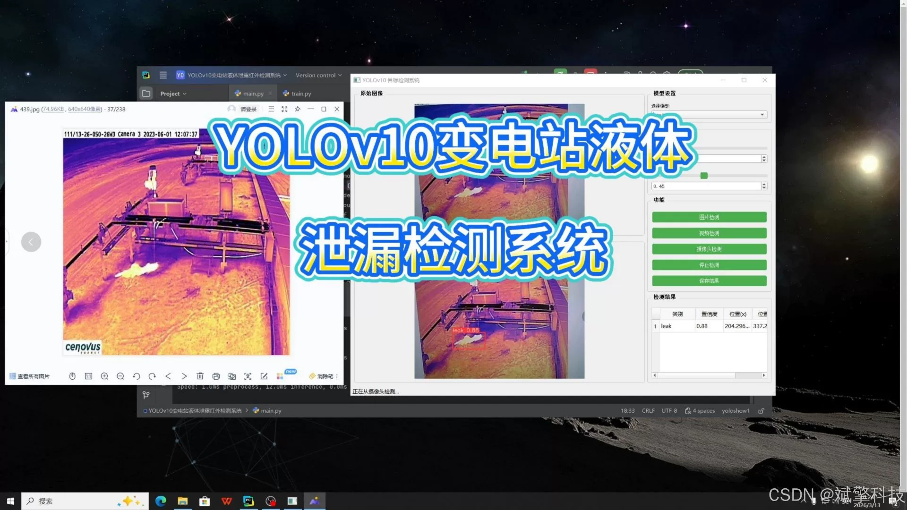
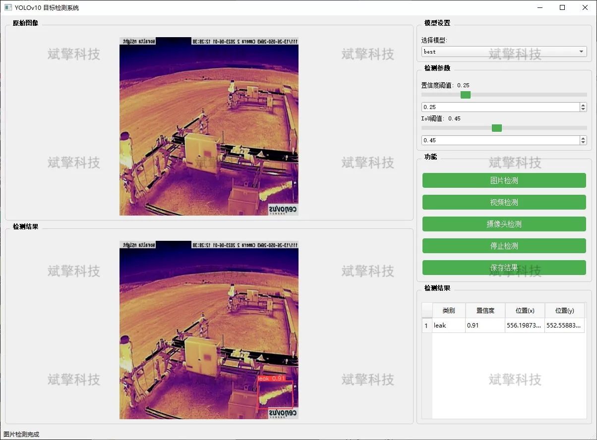
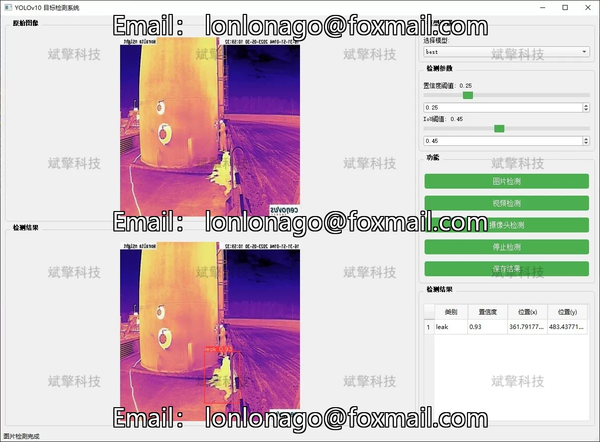
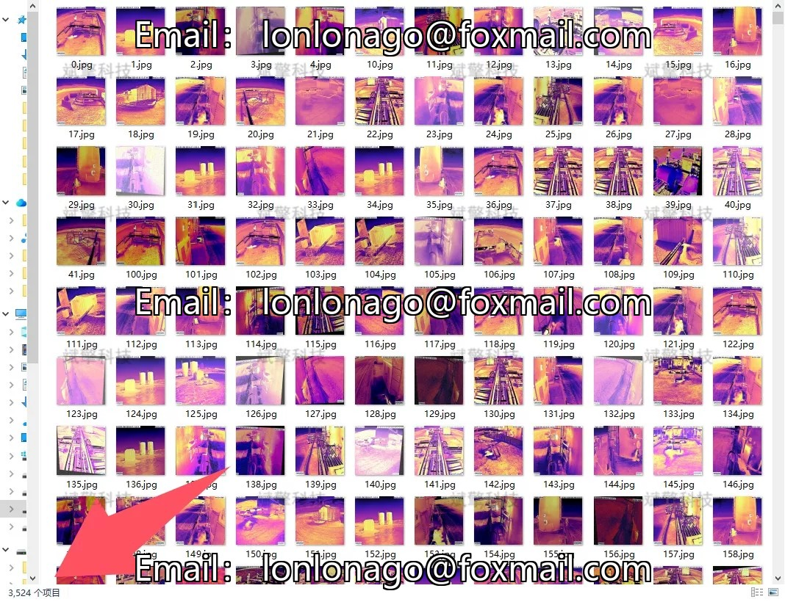
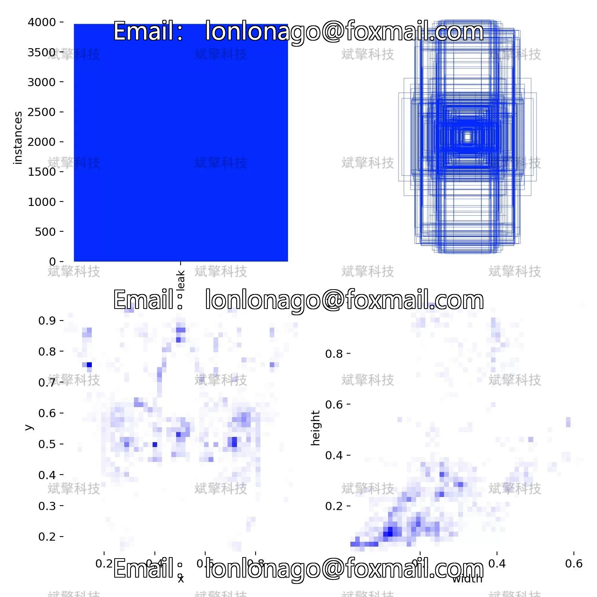
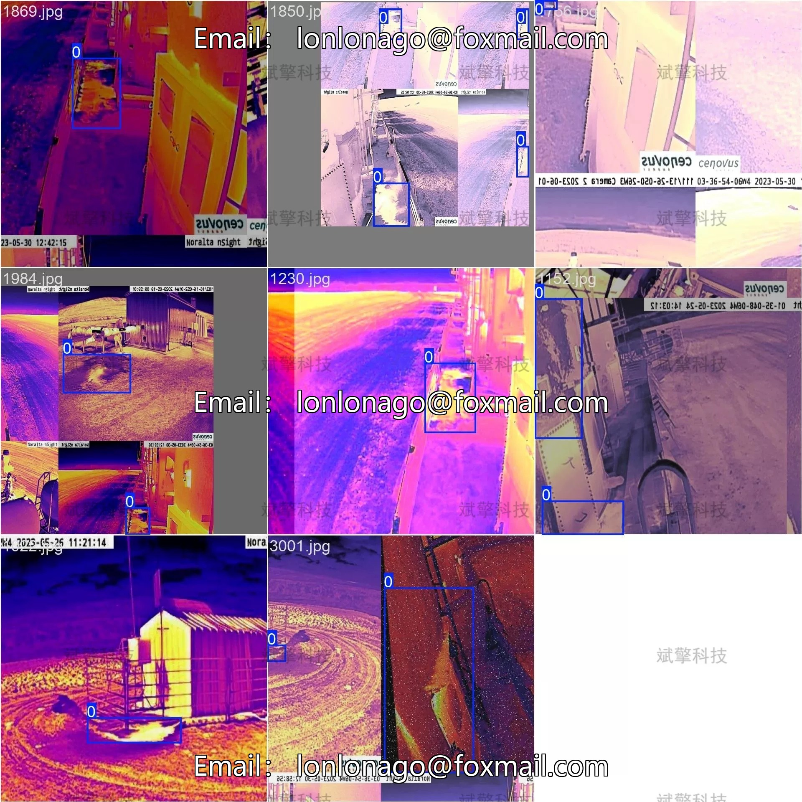
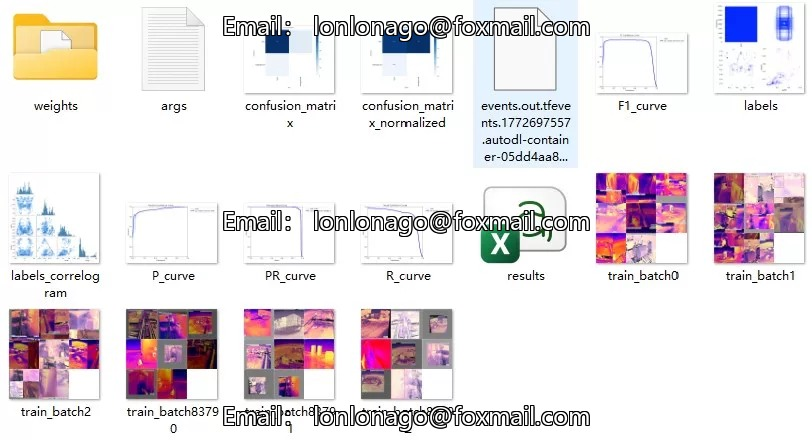
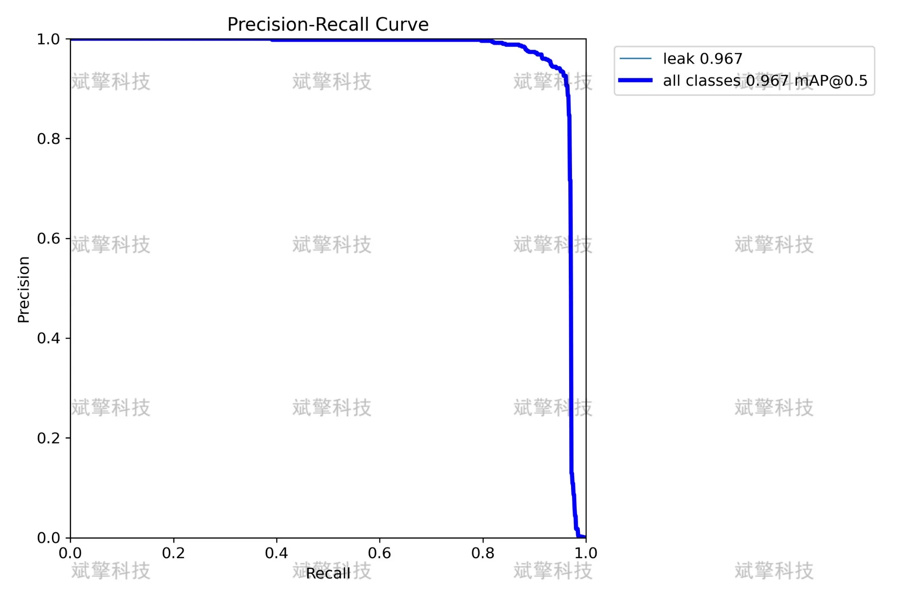
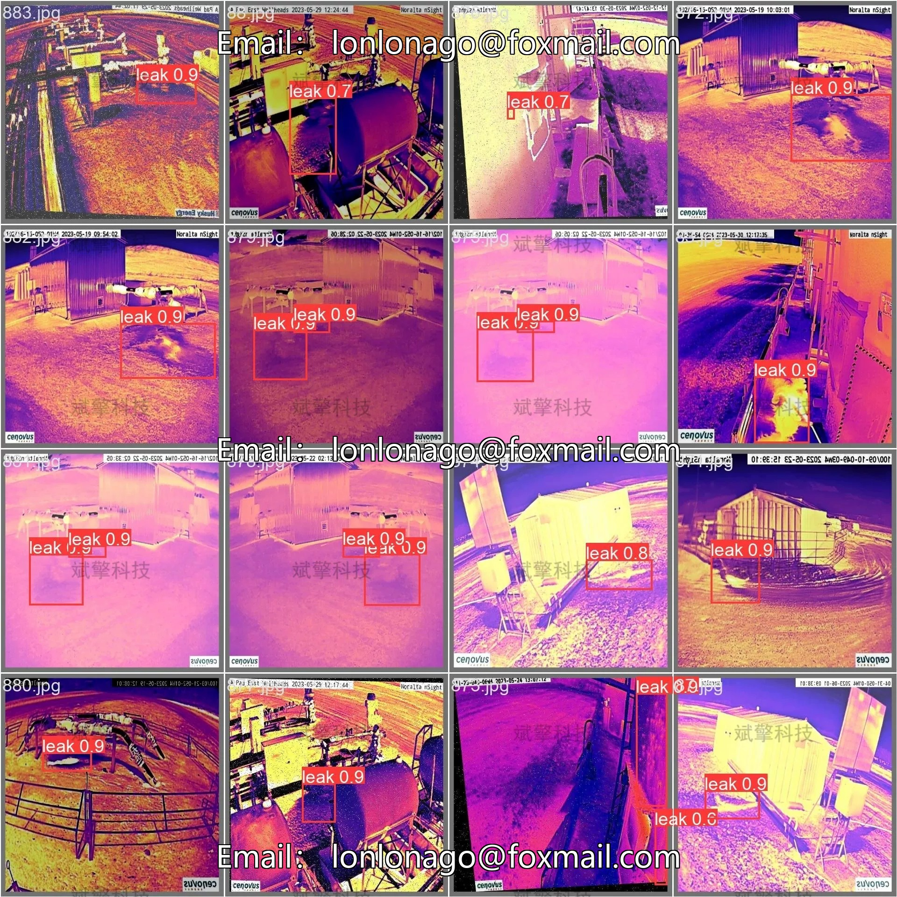

# YOLOv10 Substation Leakage Detection System

## Body

The YOLOv10 Substation Leakage Detection System is based on the YOLOv10 deep learning model for substation liquid leakage infrared detection. The system utilizes infrared thermal imaging technology, which is unaffected by lighting and can capture temperature anomalies, combined with cutting-edge target detection algorithm YOLOv10 to achieve automatic, real-time, and precise recognition of areas with liquid leakage in substation equipment. The application of this system will effectively enhance the level of intelligent inspection in substations, reduce maintenance costs, and ensure the safe operation of the power grid.
This system aims to build an end-to-end intelligent solution for substation liquid leakage detection. The project adopts YOLOv10 as the core detection framework, fully utilizing its efficient and accurate real-time detection capabilities, and specifically optimizes for small liquid leakage targets in complex backgrounds of substations.

System Features:
✅ Image detection: Can detect images and return detection boxes and category information.
✅ Video detection: Supports video file input, detecting the situation in each frame of the video.
✅ Real-time camera detection: Connects a USB camera to achieve real-time monitoring.
✅ Parameter real-time adjustment (confidence and IoU thresholds)

Dataset Overview:
Training set: 3524 images
Validation set: 504 images
Test set: 1007 images

## Images

## Payment

Here is a pay link on Stripe ( https://buy.stripe.com/3cs8yP7sY87d0vu9AB ). Please contact me lonlonago@foxmail.com after funding $89, and I will send you a complete data files , thank you!

